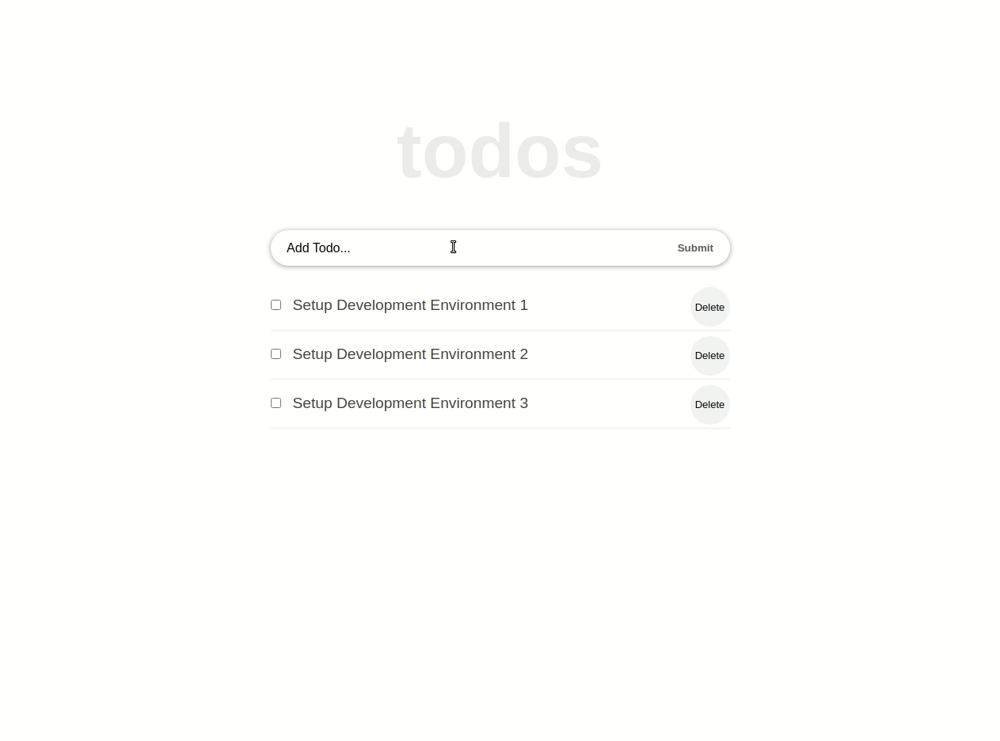

# React ToDo List

> This is a simple ToDo App created using React meant to consolidate all my knowledge about components, props, state, and hooks.   

)

This ToDo App is a simple but complex enough project to get started in React. Considering how a ToDo App works, it integrates a set of features for which using React is useful. You have DOM rendering, event manipulation, states, props, and lifting state up. 

## Built With

- HTML/CSS, JavaScript.
- React.
- Visual Studio Code.


## Getting Started

To get a local copy up and running follow these simple example steps.

- Clone this repository with git clone```https://github.com/JohnFTitor/react-to-do-list.git``` using your terminal or command line.
- Change to the project directory by entering : <br>
```cd react-to-do-list``` in the terminal

### Prerequisites

You need to make sure to have installed the latest version of Node.js and npm on your computer.

### Setup

You can clone this repository or simply download the files as a .zip
If you want to set up a personal repository based on this one, you can as well fork it.

### Install

After clone it and before working on it, you have to run ```npm install``` so that all the dependencies of the project get downloaded in your pc locally.
Such dependencies include React and linters checks, for which you have to get the files using the commands inside linters.yml. 

### Usage

You're free to use this project however you like it for educational purposes. Just keep in mind the acknowledgment described below

### Run linters checks

Linter Checks are automatically run with Github actions when there's a pull request. If you want to run them locally, remember to have the config file in the root of the local project. 

## Authors

👤 **Andrés Felipe Arroyave Naranjo**

- GitHub: [@JohnFTitor](https://github.com/JohnFTitor)
- Twitter: [@johnftitor](https://twitter.com/johnftitor)
- LinkedIn: [Andres](https://www.linkedin.com/in/andresfelipe117/?locale=en_US)

## Acknowledgments

This project was built following the tutorial from [IbasLogic](https://ibaslogic.com/react-tutorial-for-beginners/). If you want to deepen your understanding of React, definitely follow this tutorial.

## Show your support

Give a ⭐️ if you like this project!

## 📝 License

This project is [MIT](./MIT.md) licensed.